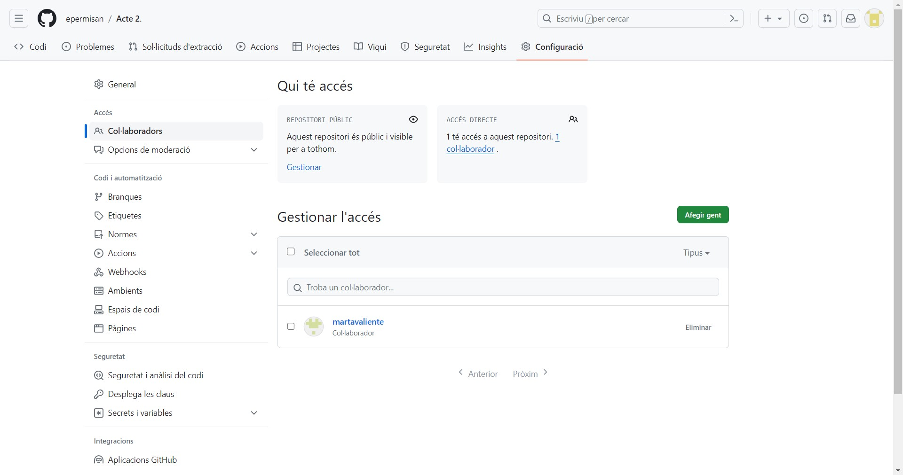
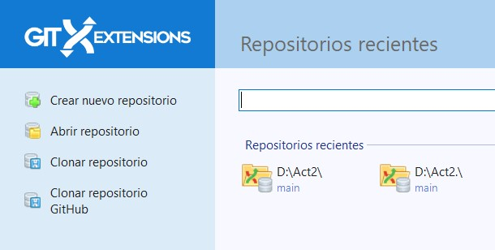
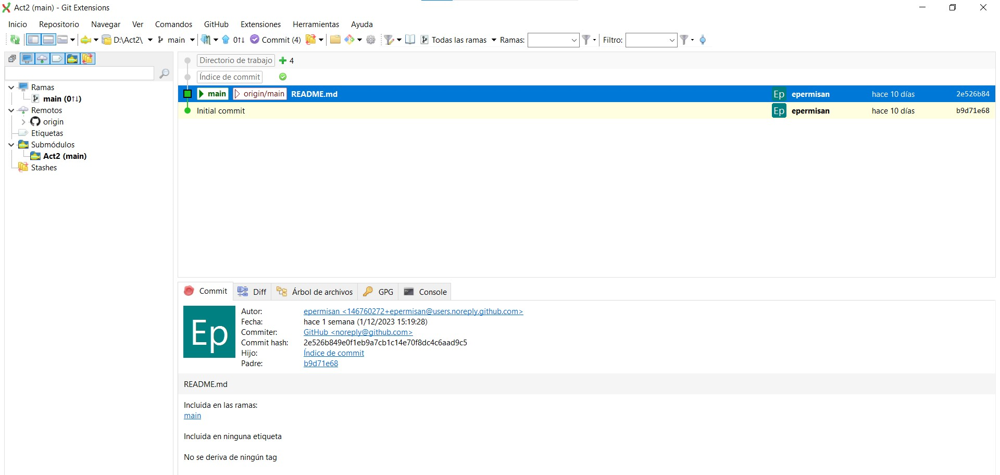

## cómo hiciste que el repositorio se pudiera compartir
- Primero, ingresas a github y vas a tu trabajo.
- Ingresa a Configuración y ve a Colaborador.

- Haz clic en AÑADIR PERSONAS y pon el nombre de la persona con la que quieres trabajar.

- Cuando la otra persona acepte la petición, podréis trabajar juntos.

## cómo se clona en Git Extensions
- Primero, necesitas instalar la extensión Git.
- cuando lo tengas entra y dale clic en Clonar repositorio.

- Después, debes poner el enlace de Github, colocarlo donde quieras el Clon y hacer clic en el botón Clonar.

- Cuando tengas todos los clones ingresas al archivo.
